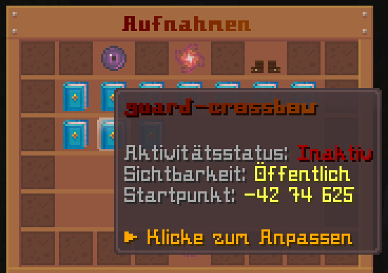
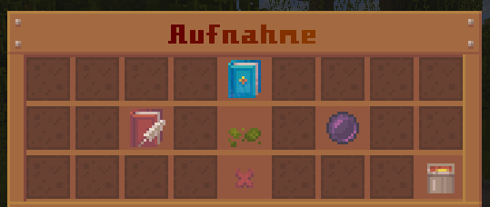

# PhantomReplay 👻

Hauche deiner Minecraft-Welt Leben ein! PhantomReplay ist ein Paper-Plugin, das deine Bewegungen und Aktionen aufzeichnet und sie als lebensechte NPC-Phantome wieder abspielt.

Egal ob du PvP-Kämpfe nachstellen 🥊, Tutorials kreieren 📖, komplexe Parkour-Geister erschaffen 🦘 oder einfach deine Server-Lobby mit realistischen Hintergrundcharakteren 🤡 beleben möchtest – 👻 PhantomReplay macht es möglich.

Der Schwerpunkt des Plugins liegt auf drei Dingen:

1. Bewegungen möglichst verlustarm und speicherarm aufzuzeichnen
2. Diese Aufnahmen im Spiel wieder steuerbar abzuspielen
3. Minecraft-Welten lebendiger wirken zu lassen

Damit lassen sich unter anderem PvP-Szenen, belebte Dorfbewohner, Jump & Runs oder andere atmosphärische Situationen simulieren.

Die Steuerung erfolgt über klassische Commands oder bequem über ein In-Game-GUI. Das Menü bietet dir dabei alle Funktionen, die auch der `/replay`-Command abdeckt, und erweitert diese um mächtige Weitere Aktionen: Du kannst nun mit nur einem Klick alle deine Replays gleichzeitig aktivieren/deaktivieren oder die Sichtbarkeit für alle Aufnahmen auf einmal anpassen. Das GUI öffnet sich aktuell über `/playback`.

**Das globale Replay-Menü:**


**Die Detailansicht einer einzelnen Aufnahme:**


## Aktueller Funktionsumfang

- **Bewegung & Blickrichtung:** Millisekundengenaue Aufzeichnung von Laufwegen und Kopfbewegungen.
- **Aktions-Tracking:** Erfasst Sprints, Sneaken, das gehaltene Item und Linksklicks (Schlagen/Interagieren).
- **Simultane Wiedergabe:** Lass mehrere Replays gleichzeitig abspielen, um Interaktionen zwischen verschiedenen Phantomen zu erzeugen.
- **Sichtbarkeits-Modi:** Bestimme über GLOBAL oder PRIVAT, ob jeder Spieler das Replay sehen darf oder nur du selbst.
- **Packet-basierte NPCs:** Die Replays existieren nicht als physische Entities auf dem Server, was massiv Leistung spart.
- **Intuitives GUI-Management:** Verwalte alle deine Aufnahmen zentral über ein Menü, navigiere in spezifische Detailansichten pro Replay oder steuere Aufnahmen gleichzeitig über die globalen Toggles.

## Commands

### `/record`

Startet und stoppt eine Aufnahme.

```text
/record start
/record stop
```

Mit `start` beginnt die Aufnahme des aktuellen Spielers. Mit `stop` wird die Aufnahme gespeichert und als Replay angelegt.

### `/replay <name>`

Verwaltet ein vorhandenes Replay.

```text
/replay <name>
/replay <name> play <true|false>
/replay <name> visibility <GLOBAL|PRIVAT>
/replay <name> rename <new_name>
/replay <name> delete
```

Ohne Unterbefehl zeigt der Command eine Info über das Replay an:

- ob es aktiv ist
- welche Sichtbarkeit gesetzt ist
- welche Session-ID verwendet wird

### Relevante Permissions

- `phantomreplay.record`
- `phantomreplay.replay`
- `phantomreplay.replay.play`
- `phantomreplay.replay.visibility`
- `phantomreplay.replay.rename`
- `phantomreplay.replay.delete`
- `phantomreplay.gui.playback`

## Konfiguration

In `config.yml` lassen sich aktuell die Datenbank und die maximale Aufnahmedauer konfigurieren.

```yml
database:
  host: "127.0.0.1"
  port: 3306
  name: "plugin_db"
  user: "admin"
  password: "password"

record:
  max-ticks: 1200
```

`record.max-ticks` begrenzt die Länge einer Aufnahme in Ticks.

## Technischer Stand

Das Plugin nutzt:

- Paper
- ProtocolLib
- HikariCP + MariaDB für Connection Pooling und Datenbank

Die Replay-Daten werden serverseitig gespeichert und beim Join wieder geladen. Für die Darstellung werden echte Spielerdaten nicht als echte Spielerinstanzen eingeblendet, sondern als packetbasierte NPCs simuliert.

## Geplante Features 👀

- **Aufnahme-HUD:** Bessere visuelle Darstellung der laufenden Aufnahmedauer und Restzeit über die Actionbar.
- **Countdown:** Ein Timer vor dem Startschuss einer Aufnahme.
- **Erweitertes Tracking:** Aufzeichnung zusätzlicher Interaktionen (Kisten öffnen, Fernrohr-Nutzung, Essen-Animationen, etc.).
- **Custom NPCs:** Zuweisung von eigenen Spielernamen, Nametags und individuellen Skins für die abgespielten Phantome.
